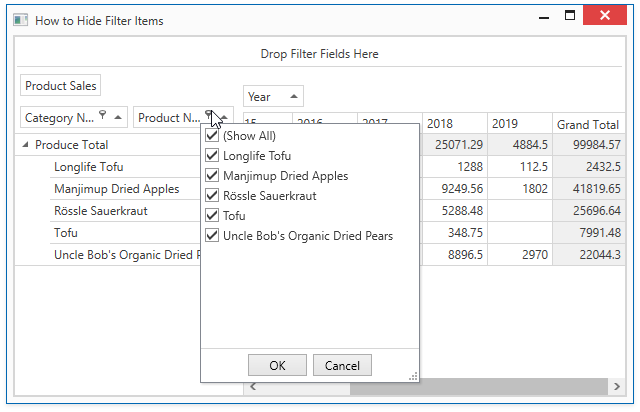

<!-- default badges list -->

<!-- default badges end -->
<!-- default file list -->
*Files to look at*:

* [MainWindow.xaml](./CS/DXPivotGrid_HowToHideFilterItems/MainWindow.xaml) (VB: [MainWindow.xaml](./VB/DXPivotGrid_HowToHideFilterItems/MainWindow.xaml))
* [MainWindow.xaml.cs](./CS/DXPivotGrid_HowToHideFilterItems/MainWindow.xaml.cs) (VB: [MainWindow.xaml.vb](./VB/DXPivotGrid_HowToHideFilterItems/MainWindow.xaml.vb))
<!-- default file list end -->
# How to hide filter items whose corresponding field values are not displayed

This example demoinstrtates  how to hide filter items whose field values are filtered out by another filter.

In this example, the Row Header Area contains two fields: 'Category Name' and 'Product Name'. If an end-user hides a particular product category in the 'Category Name' field's filter drop-down, the products in that category are excluded from the filter drop-down of the 'Product Name' field. The [CustomFilterPopupItems](https://docs.devexpress.com/WPF/DevExpress.Xpf.PivotGrid.PivotGridControl.CustomFilterPopupItems) is handled to hide filter items.

Note that you can set the [PivotGridControl.ShowOnlyAvailableFilterItems](https://docs.devexpress.com/WPF/DevExpress.Xpf.PivotGrid.PivotGridControl.ShowOnlyAvailableFilterItems) property to **true** for the same effect.

API in this example:

* [CustomFilterPopupItems](https://docs.devexpress.com/WPF/DevExpress.Xpf.PivotGrid.PivotGridControl.CustomFilterPopupItems) event
* [PivotGridField.GetVisibleValues](https://docs.devexpress.com/WPF/DevExpress.Xpf.PivotGrid.PivotGridField.GetVisibleValues) method
* [PivotCustomFilterPopupItemsEventArgs.Items](https://docs.devexpress.com/WPF/DevExpress.Xpf.PivotGrid.PivotCustomFilterPopupItemsEventArgs.Items) property
* [PivotGridFilterItem](https://docs.devexpress.com/CoreLibraries/DevExpress.XtraPivotGrid.Data.PivotGridFilterItem) class
* **ExcelItemsSource** extension - requires the DevExpress.Xpf.Core.Extensions and DevExpress.DataAccess libraries.

See also:

* [Filtering Basics](https://docs.devexpress.com/WPF/8010)
